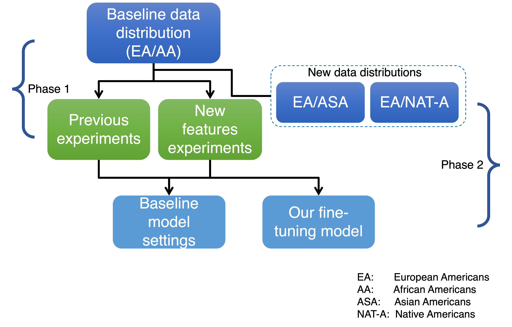

Reducing healthcare disparities using multiple multiethnic data distributions with fine-tuning of transfer learning
===================================================================================================================

**Abstract:** Healthcare disparities in multiethnic medical data is a major
challenge; the main reason lies in the unequal data distribution of ethnic
groups among many data cohorts. Biomedical data collected from different cancer
genome research projects may consist of mainly one ethnic group, such as people
with European ancestry. In contrast, the data distribution of other ethnic races
such as African, Asian, Hispanic, and Native Americans can be less visible than
the counterpart. Data inequality in the biomedical field is an important
research problem, resulting in the diverse performance of machine learning
models while creating healthcare disparities. Previous researches have reduced
the healthcare disparities only using limited data distributions. In our study,
we work on fine-tuning of deep learning and transfer learning models with
different multiethnic data distributions for the prognosis of 33 cancer types.
In previous studies, to reduce the healthcare disparities, only a single ethnic
cohort was used as the target domain with one major source domain. In contrast,
we focused on multiple ethnic cohorts as the target domain in transfer learning
using the TCGA and MMRF CoMMpass study datasets. After performance comparison
for experiments with new data distributions, our proposed model shows better
performance for transfer learning schemes compared to the baseline approach for
old and new data distribution experiments.

Installation instructions
-------------------------

To run the experiments, please create a virtual conda environment with Python
3.6. Then install the required packages from requirements.txt file

-   Install the Requirements.txt from following command

    `conda install --file requirements.txt`

-   Install Lasgange by running following command

    `pip install -r
    http://raw.githubusercontent.com/Lasagne/Lasagne/master/requirements.txt`

We performed model testing using NVIDIA GeForce RTX2080 Ti with 64 GB memory.

Dependencies:

-   python==3.6

-   numpy==1.15.4

-   numpydoc==0.9.1

-   scipy==1.2.1

-   seaborn==0.9.0

-   sklearn==0.0

-   skrebate==0.6

-   Theano==1.0.3

-   Keras==2.2.4

-   Keras-Applications==1.0.8

-   Keras-Preprocessing==1.1.0

-   tensorboard==1.13.1

-   tensorflow==1.13.1

-   tensorflow-estimator==1.13.0

-   statsmodels==0.9.0

-   lifelines==0.16.3

-   Optunity==1.1.1

-   xlrd==1.2.0

-   XlsxWriter==1.1.8

-   xlwings==0.15.8

-   xlwt==1.3.0

 

Dataset
-------

All mRNA and Protein feature expression datasets are in data folder. Also,
download the mRNA feature expression dataset ('mRNA.mat' – around 10GB) from
figshare, and place in data folder

<https://figshare.com/articles/dataset/Gao_Y_Cui_Y_2020_/12811574>

 

Multiple multiethnic experiments
--------------------------------

There are 5 multiethnic experiments schemes based on the source and target
domains, as shown in Table 1. For all these 5 schemes, there are 3
classification methods:

1.  mixture learning

2.  independent (one_race) learning

3.  transfer learning

Transfer learning experiments are performed with three different ethnic
compositions of source and target domains (source domain --\> target domain),
such as:

1.  EA --\> AA

2.  EA --\> NAT-A

3.  EA --\> ASA

To run the model with different features combinations (as in Supplementary Table
1) and with multiethnic data distributions (as in Table 1), please change the
experiment settings in main method of experiments files in EA_ASA and EA_NAT
folders.

 

### Reproducing figures

-   to reproduce the figure 5, please run the 'UCEC_mRNA_DSS_2_EA_ASA.py'

-   to reproduce the figure 7, please run the 'CESC_mRNA_OS_2_EA_NAT.py'
